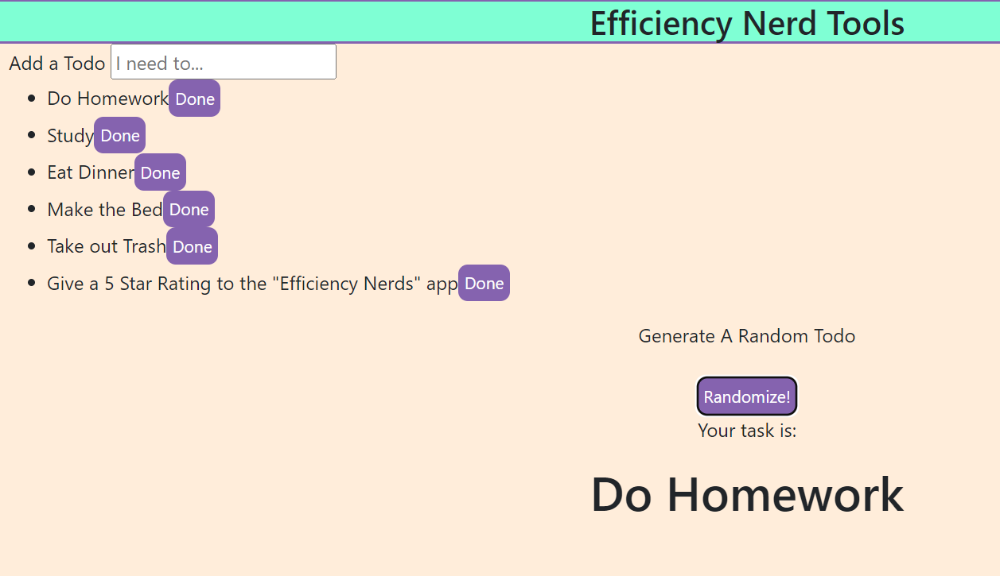
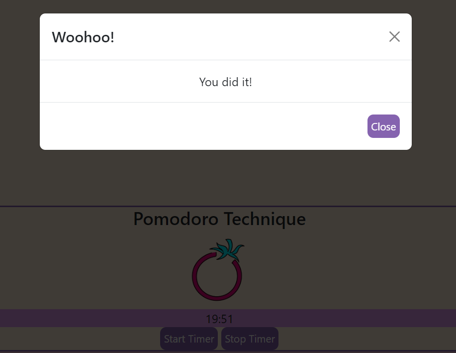

# <Efficiency-Nerds>

## Description

Our group was interested in creating an app that helped users accomplish or meet a personalized goal for each user. Our ideas varied so we combined most of them into Effeciency Nerds. Efficiency Nerds is a productivity social media app that allows users to create their profile, a la MySpace, and access the built-in productivity tools to be effective and efficient. We want people to connect with others to build community and meet their goals together. We are only at the profile development stage and plan to further develop additional features and connectivity opportunities. 

Throughout the process, we honed in a lot of our javascript and CSS/Bootstrap skills primarily how to effectively use GitHub and work as a team. We learned about what it’s like working with code for extended periods and the strong need to figure out the broken code.


## Installation

What are the steps required to install your project? Provide a step-by-step description of how to get the development environment running.

## Usage
-On Landing Page, fill out all requested account information. 
-When information is entered, click "Create Account" button.
-When Create Account Button is clicked, you will be redirected to Profile Page. 
-From the profile page, you can add a Profile Image, and you will see your informatoin you entered from the Landing Page.
-In the Efficiency Nerd Tools Section, you have a ToDo List that will generate Tasks you write in the box.
-After you enter your tools, you can generate a Random Task to Work on. 
-When you have completed a task, you click "Done" button next to your completed task and the task will be removed from your list. ```md
    
    ```
-At the bottom of the page, you can set a 20 minute timer to work on your tasks. 
-If you complete the task before your timer runs out, click "Stop Timer" and there is a Modal that pops up with an affirmation that you finished your task!
   ```md
    
    ```

## Credits

Dafne Luna - https://github.com/dafnefluna
Molly Howard - https://github.com/mollyhoward319
Usama Badarr - https://github.com/usamabadarr

Bootstrap - getbootstrap.com
W3 Schools - https://www.w3schools.com/

## License

The last section of a high-quality README file is the license. This lets other developers know what they can and cannot do with your project. If you need help choosing a license, refer to [https://choosealicense.com/](https://choosealicense.com/).

---

🏆 The previous sections are the bare minimum, and your project will ultimately determine the content of this document. You might also want to consider adding the following sections.


## Features

After a Nerd user registers or logs in, they will be redirected to the homepage where they will see a profile overview and different productivity features. 

The profile features the ability to upload and change your picture as many times as you like. You will also see a sticker sheet, which is a collection of sticker awards for completing tasks and meeting your goals. At the moment this feature does not work but is under development.

The heart of Efficiency Nerds is the Efficiency Nerd Tools. At the moment users can create their to-do lists by simply adding to our To-Do List form. For users who may struggle with executive dysfunction issues, we created a task randomizer that will draw from the existing to-do list and pick a task for you to do.

The last feature is the Pomodoro Timer. The Pomodoro Method is a task timing technique that gives you 20 minutes to work uninterrupted with a 5-minute break, and users can repeat that cycle as many times as needed. Our timer will run for 20 minutes, but we understand some people have complicated lives so they can stop the timer. Once the timer is stopped Nerds will be shown a congratulatory message. 

In future development, we hope to track the frequency of the Pomodoro cycle, and the number of tasks completed, to establish the sticker reward system.
